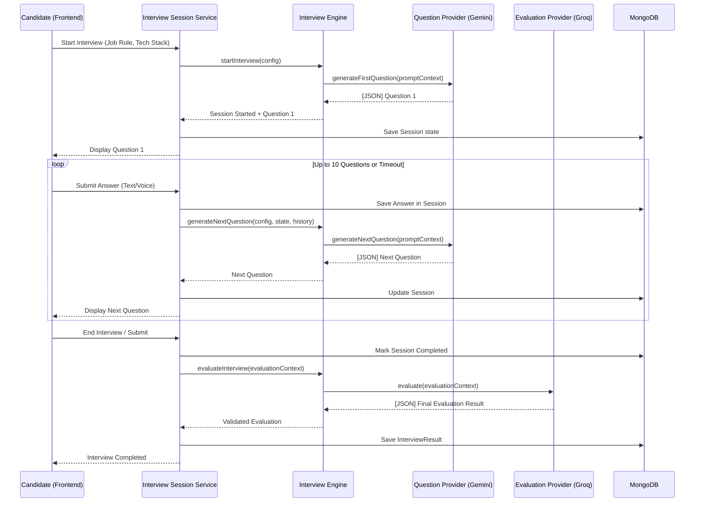

# AI Interview Flow: 0 to 100

This document outlines the end-to-end flow of the conversational AI Interview process, detailing how context is built, how questions are adaptively generated, and how the final evaluation is performed.

## 1. System Architecture & Flowchart

The system follows a strict orchestrator pattern where the `InterviewEngine` coordinates between specialized providers without containing business logic itself.



## 2. Interview Context & State

The `PromptContext` is the single source of truth passed to the AI Providers. It aggregates three main pieces of state:

1. **InterviewConfig**: Statically defined when the interview is created.
   - `jobRole`: e.g., "Frontend Developer"
   - `topics`: e.g., ["React", "JavaScript", "System Design"]
   - `experienceLevel`: e.g., "Intermediate"
2. **InterviewState**: Dynamic metadata of the ongoing session.
   - `currentQuestionIndex`: e.g., 3
   - `totalQuestions`: e.g., 10
3. **ConversationHistory**: The ongoing transcript of Q&A.
   - Used heavily for generating follow-ups (adaptive questioning) or pivoting to new topics.

## 3. Question Generation (Gemini)

Questions are generated via the `GeminiQuestionProvider`. The pipeline ensures the AI output is strictly JSON and schema-validated before returning to the frontend.

### Request Pipeline
`Config` ➔ `PromptContext` ➔ `QuestionPromptBuilder` ➔ `PromptValidator` ➔ `AI Provider (Gemini)` ➔ `QuestionResponseParser` ➔ `QuestionResponseValidator` ➔ **Validated Question Array**

### Expected Output JSON (Schema)
The AI is strictly prompted to return an array of question objects (typically a single question for adaptive generation):

```json
[
  {
    "question": "Can you explain the virtual DOM in React and why it's beneficial for performance?",
    "topic": "React",
    "difficulty": "Medium",
    "expectedPoints": [
      "Mentions in-memory representation of UI",
      "Mentions diffing algorithm / reconciliation",
      "Mentions batching of DOM updates"
    ]
  }
]
```

*Note: The system includes a Domain Validator that throws an error if prohibited keywords (like "consultancy", "sales strategy") are generated, ensuring the AI stays strictly within technical boundaries.*

## 4. Final Evaluation (Groq)

When the candidate completes the interview (or the timer runs out), the `InterviewEngine` triggers `evaluateInterview`, which delegates to the `GroqEvaluationProvider`.

### Request Pipeline
`EvaluationContext` (Full Transcript) ➔ `EvaluationPromptBuilder` ➔ `AI Provider (Groq)` ➔ `EvaluationResponseParser` ➔ `EvaluationResponseValidator` ➔ **Validated Result**

### Expected Output JSON (Schema)
The AI is instructed to evaluate the entire transcript and provide both overall scores and question-level breakdowns. 

```json
{
  "scores": {
    "overall": 8.5,
    "technical": 8.0,
    "communication": 9.0,
    "problemSolving": 8.5,
    "confidence": 8.0,
    "topicCoverage": 9.0
  },
  "recommendation": "STRONG_HIRE",
  "reasoning": "The candidate demonstrated excellent knowledge of React internals and communicated clearly...",
  "strengths": [
    "Deep understanding of React hooks",
    "Clear communication style"
  ],
  "weaknesses": [
    "Struggled slightly with advanced CSS Grid concepts"
  ],
  "questionEvaluations": [
    {
      "questionId": "q_1",
      "scores": {
        "technical": 8.5,
        "communication": 9.0
      },
      "feedback": "Great explanation of the Virtual DOM. You hit all the key points.",
      "keyTakeaways": [
        "Strong fundamental knowledge",
        "Clear analogies used"
      ]
    }
  ]
}
```

*Note: The `RecommendationEnum` strictly requires one of: `STRONG_HIRE`, `HIRE`, `BORDERLINE`, `NEEDS_IMPROVEMENT`, or `REJECT`.*

## 5. Resilience & Error Handling
- **Retries:** AI generations (especially question generation) have a built-in max retry limit (e.g., 3 attempts) in case of malformed JSON or network failures.
- **Parsing:** Custom `ResponseParser` classes attempt to strip out markdown formatting (like ````json ... ````) before executing `JSON.parse()`.
- **Validation:** Zod schemas are used in `QuestionResponseValidator` and `EvaluationResponseValidator` to strip out unknown fields and strictly enforce types, preventing database corruption.
