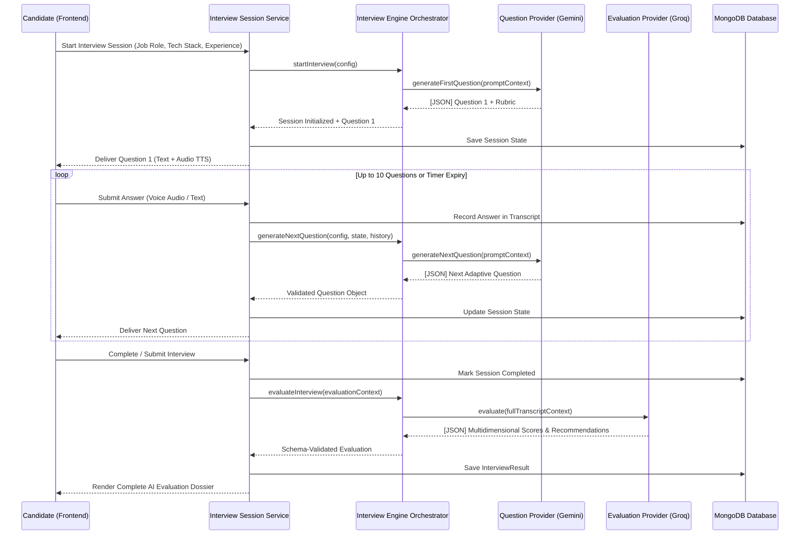
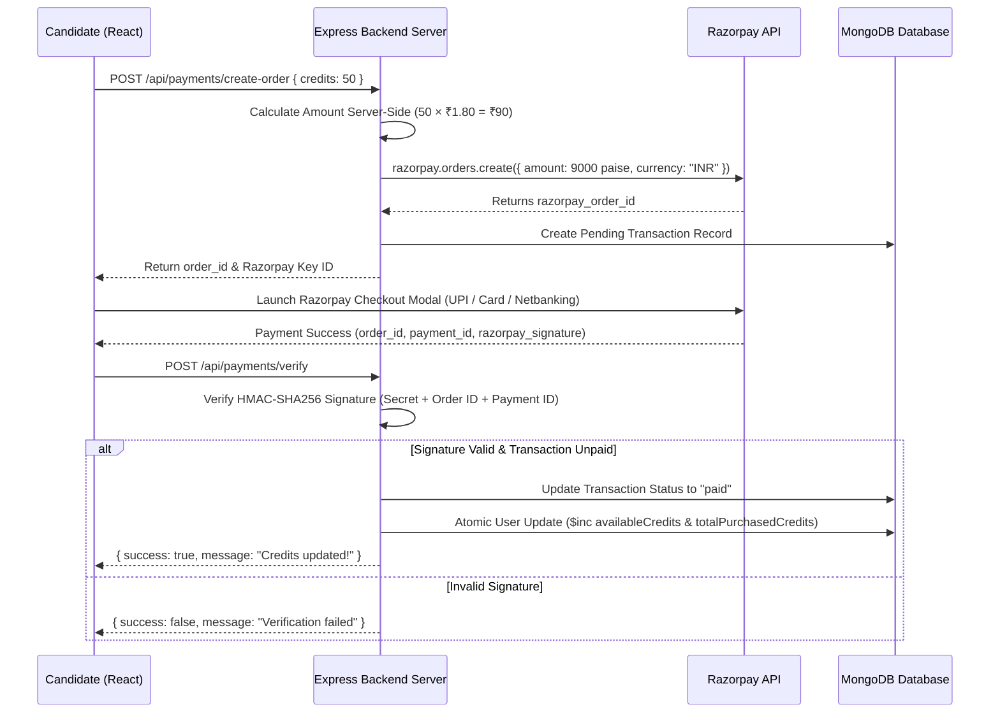

# 🚀 InterviewOS — Production-Grade AI Interviewer & Screening Platform

[](https://nodejs.org/)
[](https://react.dev/)
[](https://expressjs.com/)
[](https://www.mongodb.com/)
[](https://tailwindcss.com/)
[](https://groq.com/)
[](LICENSE)

> An enterprise-grade, full-stack AI recruitment and mock interview platform. Built with an adaptive multi-model AI engine (**Google Gemini** & **Groq Llama 3**), real-time speech processing (**Groq Whisper** STT & **Edge TTS**), interactive **3D AI avatar**, visual proctoring (**MediaPipe**), and a unified **Razorpay credit monetization wallet**.

---

## 📌 Table of Contents

- [Overview](#-overview)
- [✨ Key Features](#-key-features)
- [🏗️ System Architecture](#️-system-architecture)
  - [End-to-End Interview Engine Flow](#end-to-end-interview-engine-flow)
  - [Credit Wallet & Razorpay Payment Architecture](#credit-wallet--razorpay-payment-architecture)
- [💻 Tech Stack](#-tech-stack)
- [📂 Project Structure](#-project-structure)
- [⚙️ Environment Variables](#️-environment-variables)
- [🚀 Quick Start & Installation](#-quick-start--installation)
- [📊 Comprehensive Evaluation Schema](#-comprehensive-evaluation-schema)
- [💳 Monetization & Credit Wallet Model](#-monetization--credit-wallet-model)
- [🔌 API Endpoints Reference](#-api-endpoints-reference)
- [🗺️ Future Roadmap](#️-future-roadmap)
- [🤝 Contributing & License](#-contributing--license)

---

## 🔍 Overview

**InterviewOS** solves the bottleneck in technical hiring and candidate preparation. It acts as a dual-sided platform:

1. **For Candidates**: An interactive, low-stress mock interview simulator that provides real-time voice & text questioning, adaptive follow-ups, dynamic difficulty adjustments, and actionable AI evaluation reports across multiple technical and soft-skill metrics.
2. **For Employers**: An automated screening platform to publish job requisitions, invite candidates, monitor live sessions, review AI-generated leaderboards, export structured PDF candidate dossiers, and flag potential proctoring violations.

---

## ✨ Key Features

### 🎙️ Adaptive Multi-Model AI Engine
- **Provider Architecture**: Seamlessly delegates question generation to **Google Gemini (`gemini-1.5-flash`)** and candidate evaluation to **Groq (`llama-3.1-8b-instant`)** with multi-model failover support.
- **Adaptive Context Engine**: Tracks `InterviewConfig` (role, topic, experience), `InterviewState` (question index, difficulty), and `ConversationHistory` to generate contextual follow-up questions dynamically.
- **Strict Schema Enforcement**: Custom response parsers and **Zod** schema validators ensure standard JSON output from LLMs without runtime crashes or prompt injection hazards.

### 🔊 Multimodal Voice & Visual Experience
- **Speech-to-Text (STT)**: Direct voice responses transcribed using **Groq Whisper (`whisper-large-v3`)**.
- **Text-to-Speech (TTS)**: Conversational AI voice synthesis powered by **Node Edge TTS** (`en-US-AriaNeural`).
- **Interactive 3D Avatar**: Real-time rendering via **Three.js** / **React Three Fiber** (`@react-three/fiber` & `@react-three/drei`).
- **Visual Anti-Cheating Telemetry**: Computer vision tracking powered by **MediaPipe Tasks Vision** to detect face presence, multiple persons, camera status, tab switching, and focus loss.

### 💳 Unified Credit Wallet & Monetization
- **1 Credit = 1 Interview Minute**: Transparent usage metric for candidates.
- **Starter Bonus**: 15 free credits automatically awarded upon candidate signup.
- **Tiered Razorpay Integration**:
  - `< 50 Credits`: ₹2.50 / credit
  - `≥ 50 Credits`: ₹1.80 / credit (Bulk Discount Rate)
- **Security & Integrity**: Server-side price calculation, HMAC-SHA256 signature verification, idempotency protection against replay attacks, and fallback webhook support.

### 📊 In-Depth STAR Method Evaluation & Reporting
- **Multidimensional Scoring**: Technical Accuracy, Communication, Problem Solving, Confidence, and Topic Coverage scored on a 1–10 scale.
- **Granular Question Feedback**: Question-by-question analysis against expected domain rubrics.
- **Recommendation Status**: Structured hiring signal (`STRONG_HIRE`, `HIRE`, `BORDERLINE`, `NEEDS_IMPROVEMENT`, `REJECT`).

---

## 🏗️ System Architecture

### End-to-End Interview Engine Flow



### Credit Wallet & Razorpay Payment Architecture



---

## 💻 Tech Stack

### Frontend
- **Framework**: React 19 + Vite 7
- **Styling**: Tailwind CSS v4, Glassmorphism design system
- **State & Routing**: React Router v7, React Hook Form + Zod
- **Animations & 3D**: Framer Motion, Three.js, `@react-three/fiber`, `@react-three/drei`
- **Computer Vision**: `@mediapipe/tasks-vision`
- **Charts & UI**: Recharts, Radix UI Primitives, Lucide Icons, React Hot Toast
- **HTTP & Auth**: Axios, `@react-oauth/google`

### Backend
- **Runtime**: Node.js (ES Modules)
- **Web Framework**: Express v5
- **Database**: MongoDB via Mongoose v9
- **Validation**: Zod v4
- **Authentication**: JWT (JSON Web Tokens), `cookie-parser`, `bcryptjs`, Google Auth Library
- **Cloud Storage**: Cloudinary (Resume & candidate asset uploads)
- **Payment Gateway**: Razorpay Node SDK (`razorpay`)

### AI & Speech Infrastructure
- **LLM Providers**: `@google/genai` (Google Gemini 1.5 Flash), `groq-sdk` (Groq Llama 3.1 8B Instant)
- **Speech-to-Text (STT)**: Groq Whisper (`whisper-large-v3`)
- **Text-to-Speech (TTS)**: `node-edge-tts` (Microsoft Edge Neural Voices) / `google-tts-api`

---

## 📂 Project Structure

```
AI-interviewer/
├── package.json                    # Root orchestration scripts (concurrently)
├── AI_INTERVIEW_FLOW.md            # Detailed AI sequence documentation
├── RAZORPAY_CREDIT_SYSTEM_FLOW.md  # Comprehensive credit & payment guide
├── PROJECT_ROADMAP_AND_MONETIZATION.md # Platform roadmap & B2B strategy
│
├── backend/                        # Express v5 REST API & AI Engine
│   ├── src/
│   │   ├── server.js               # Entry point
│   │   ├── app.js                  # Express middleware & route declarations
│   │   ├── config/                 # DB, Cloudinary, Razorpay & AI configs
│   │   ├── middleware/             # Auth, credit guard, error handler, multer
│   │   └── modules/
│   │       ├── auth/               # User signup, login, Google OAuth
│   │       ├── interview/          # Engine, providers (Gemini/Groq), evaluators
│   │       ├── voice/              # Whisper STT & Edge TTS audio controllers
│   │       ├── users/              # User profiles, credits, resume parser
│   │       ├── payments/           # Razorpay order, verification & webhooks
│   │       └── complaints/         # Feedback & candidate support ticketing
│   └── package.json
│
└── frontend/                       # React 19 Single Page Application
    ├── src/
    │   ├── app/                    # Main router & global application wrapper
    │   ├── components/             # Reusable UI primitives & layout elements
    │   ├── context/                # AuthContext, ThemeContext, CreditContext
    │   ├── features/               # Feature-based domain modules
    │   │   ├── auth/               # Login, Signup, Select Role
    │   │   ├── candidate/          # Candidate Dashboard, Credit Wallet, History
    │   │   ├── employer/           # Recruiter Requisitions, Leaderboards, Candidate Views
    │   │   └── interview/          # Live Interview Room, 3D Avatar, Mic/Cam Setup
    │   ├── services/               # Axios API client modules
    │   └── ui/                     # Shared components & protected route guards
    └── package.json
```

---

## ⚙️ Environment Variables

### Backend (`backend/.env`)

```env
# Core Server Configuration
PORT=5000
NODE_ENV=development
CORS_ORIGIN=http://localhost:5173

# Database & Authentication
MONGODB_URI=mongodb+srv://<username>:<password>@cluster.mongodb.net/ai_interviewer?retryWrites=true&w=majority
JWT_SECRET=your_super_secret_jwt_key
JWT_EXPIRE=30d

# Primary AI Provider Configuration
QUESTION_PROVIDER=groq
AI_PROVIDER=groq

# Google Gemini API
GEMINI_API_KEY=your_gemini_api_key_here
GEMINI_MODEL=gemini-1.5-flash

# Groq AI API
GROQ_API_KEY=your_groq_api_key_here
GROQ_MODEL=llama-3.1-8b-instant

# AI Generation Settings
TEMPERATURE=0.7
MAX_OUTPUT_TOKENS=2048
REQUEST_TIMEOUT=30000

# Voice Processing (STT & TTS)
SPEECH_PROVIDER=groq
GROQ_WHISPER_MODEL=whisper-large-v3
MAX_AUDIO_SIZE=10485760
SUPPORTED_AUDIO_TYPES=audio/webm,audio/mpeg,audio/mp3,audio/wav,audio/ogg,video/webm

TTS_PROVIDER=edge
DEFAULT_TTS_VOICE=en-US-AriaNeural
DEFAULT_TTS_RATE=1
DEFAULT_AUDIO_FORMAT=mp3
MAX_TTS_TEXT_LENGTH=500

# Cloudinary Integration (Resume & Media Storage)
CLOUDINARY_CLOUD_NAME=your_cloudinary_cloud_name
CLOUDINARY_API_KEY=your_cloudinary_api_key
CLOUDINARY_API_SECRET=your_cloudinary_api_secret

# Razorpay Payment Gateway
RAZORPAY_KEY_ID=rzp_test_xxxxxxxxx
RAZORPAY_KEY_SECRET=your_razorpay_secret
RAZORPAY_WEBHOOK_SECRET=your_optional_webhook_secret

# Google OAuth Credentials
GOOGLE_CLIENT_ID=your_google_client_id.apps.googleusercontent.com
GOOGLE_CLIENT_SECRET=your_google_client_secret
```

### Frontend (`frontend/.env`)

```env
VITE_API_URL=http://localhost:5000/api
VITE_GOOGLE_CLIENT_ID=your_google_client_id.apps.googleusercontent.com
```

---

## 🚀 Quick Start & Installation

### Prerequisites
- **Node.js**: v18.0.0 or higher
- **npm**: v9.0.0 or higher
- **MongoDB**: Local instance or MongoDB Atlas connection string
- **API Keys**: Groq API Key, Google Gemini API Key, Cloudinary account, Razorpay account (Test mode supported)

### 1. Clone the Repository

```bash
git clone https://github.com/Amansinghhggg/AI-interviewer.git
cd AI-interviewer
```

### 2. Install Dependencies

Install root, backend, and frontend dependencies:

```bash
# Install root dependencies
npm install

# Install backend dependencies
cd backend
npm install

# Install frontend dependencies
cd ../frontend
npm install
cd ..
```

### 3. Setup Environment Variables

Create `.env` files in both `/backend` and `/frontend` directories using the parameters documented in the [Environment Variables](#️-environment-variables) section.

### 4. Run the Application

Run both backend and frontend concurrently from the root directory:

```bash
npm run dev
```

- **Frontend**: Accessible at `http://localhost:5173`
- **Backend API**: Running at `http://localhost:5000`
- **Health Check**: `http://localhost:5000/api/health`

---

## 📊 Comprehensive Evaluation Schema

When an interview session is submitted, the AI evaluation engine analyzes the entire conversation history and returns a validated JSON dossier structured as follows:

```json
{
  "scores": {
    "overall": 8.5,
    "technical": 8.0,
    "communication": 9.0,
    "problemSolving": 8.5,
    "confidence": 8.0,
    "topicCoverage": 9.0
  },
  "recommendation": "STRONG_HIRE",
  "reasoning": "The candidate demonstrated strong mastery over asynchronous JavaScript, React virtual DOM reconciliation, and distributed system concepts. Explanations were clear and well-structured.",
  "strengths": [
    "Deep understanding of React hooks lifecycle and state optimization",
    "Clear, structured communication with practical real-world examples"
  ],
  "weaknesses": [
    "Could improve on edge-case error handling in distributed systems"
  ],
  "questionEvaluations": [
    {
      "questionId": "q_1",
      "scores": {
        "technical": 8.5,
        "communication": 9.0
      },
      "feedback": "Excellent explanation of virtual DOM diffing algorithm.",
      "keyTakeaways": [
        "Mentioned in-memory UI representation",
        "Correctly detailed fiber tree reconciliation"
      ]
    }
  ]
}
```

---

## 💳 Monetization & Credit Wallet Model

The candidate wallet operates under a **1 Credit = 1 Minute** conversion rule:

| Action | Spendable Balance (`availableCredits`) | Lifetime Counter |
| :--- | :---: | :---: |
| **New Candidate Registration** | **+15** (Starter Gift) | `totalBonusCredits: 15` |
| **Buy 50 Credits (Razorpay)** | **+50** | `totalPurchasedCredits: +50` |
| **Complete 10-Min Mock Interview** | **-10** | `totalUsedCredits: +10` |

> 🛡️ **Credit Guard Protection**: Pre-interview middleware verifies `availableCredits >= 5` before allowing a session to initialize, ensuring candidates don't start sessions without sufficient balance.

---

## 🔌 API Endpoints Reference

### 🔑 Authentication (`/api/auth`)
- `POST /api/auth/signup` — Register candidate or employer account
- `POST /api/auth/login` — Authenticate and receive JWT cookie/token
- `POST /api/auth/google` — Google OAuth authentication
- `GET /api/auth/me` — Fetch currently authenticated user context
- `POST /api/auth/logout` — Clear session authentication cookies

### 🎙️ Interview Engine (`/api/interviews` & `/api/mock-interviews`)
- `POST /api/mock-interviews/start` — Initialize mock interview (Requires Credit Guard)
- `POST /api/mock-interviews/:id/answer` — Submit candidate text/voice response
- `POST /api/mock-interviews/:id/complete` — Complete session & trigger AI evaluation
- `GET /api/mock-interviews/:id/result` — Retrieve detailed evaluation dossier

### 🔊 Voice & Audio (`/api/voice`)
- `POST /api/voice/stt` — Transcribe candidate audio blob using Groq Whisper
- `POST /api/voice/tts` — Synthesize AI question text into Edge TTS audio MP3 stream

### 💳 Payments & Wallet (`/api/payments`)
- `POST /api/payments/create-order` — Create Razorpay order with server-calculated price
- `POST /api/payments/verify` — Verify HMAC-SHA256 signature & credit user wallet
- `POST /api/payments/webhook` — Razorpay webhook listener for asynchronous event capture

### 👤 Profile & Resume (`/api/profile` & `/api/candidates`)
- `GET /api/profile` — Fetch user profile & credit wallet summary
- `POST /api/candidates/resume` — Upload resume PDF to Cloudinary and extract skill profile

---

## 🗺️ Future Roadmap

- [ ] **BullMQ + Redis Background Queue**: Offload 15s LLM evaluation jobs asynchronously for instant `202 Accepted` response.
- [ ] **WebSockets Streaming**: Low-latency token-by-token question streaming & audio chunking.
- [ ] **Interactive Monaco Code Sandbox**: Integrated code editor for live coding interviews.
- [ ] **Employer Campaign Dashboard**: Multi-candidate bulk screening with downloadable PDF ranking summaries.
- [ ] **AI Avatar Synchronization**: Lip-sync dynamic facial animations with Edge TTS audio streams.

---

## 🤝 Contributing & License

Contributions, issues, and feature requests are welcome! Feel free to check the [issues page](https://github.com/Amansinghhggg/AI-interviewer/issues).

Distributed under the **ISC License**. See `LICENSE` for more information.

---

<p center="align">
  Crafted with ❤️ by <a href="https://github.com/Amansinghhggg">Aman Singh</a>
</p>
