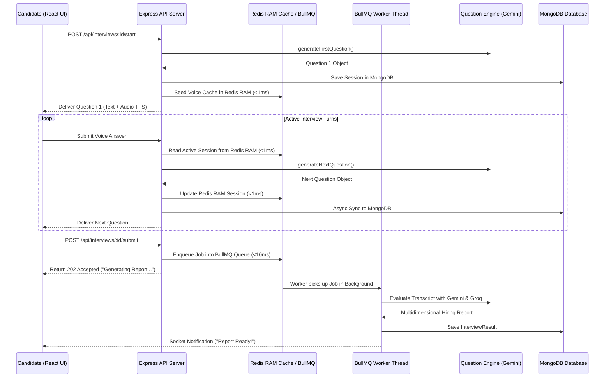

# 🚀 IntervuOS — Production-Grade AI Interviewer & Screening Platform

[](https://nodejs.org/)
[](https://react.dev/)
[](https://expressjs.com/)
[](https://www.mongodb.com/)
[](https://redis.io/)
[](https://bullmq.io/)
[](https://www.docker.com/)
[](https://tailwindcss.com/)
[](https://groq.com/)
[](LICENSE)

> An enterprise-grade, full-stack AI recruitment and mock interview platform. Powered by an adaptive multi-model AI engine (**Google Gemini 1.5 Flash** & **Groq Llama 3**), sub-millisecond **Redis Session Caching**, **BullMQ Async Workers**, real-time speech processing (**Groq Whisper** STT & **Edge TTS**), interactive **3D AI avatar**, visual proctoring (**MediaPipe**), **Resumable Chunked Video Uploads**, and a unified **Razorpay credit monetization wallet**.

---

## 📌 Table of Contents

- [Overview](#-overview)
- [✨ Key Features](#-key-features)
- [⚡ Redis High-Performance Architecture](#-redis-high-performance-architecture)
- [🏗️ System Architecture](#️-system-architecture)
  - [End-to-End Interview Engine Flow](#end-to-end-interview-engine-flow)
  - [Credit Wallet & Razorpay Payment Architecture](#credit-wallet--razorpay-payment-architecture)
- [💻 Tech Stack](#-tech-stack)
- [📂 Project Structure](#-project-structure)
- [⚙️ Environment Variables](#️-environment-variables)
- [🚀 Quick Start & Installation](#-quick-start--installation)
  - [Running Redis via Docker](#running-redis-via-docker)
- [📊 Comprehensive Evaluation Schema](#-comprehensive-evaluation-schema)
- [💳 Monetization & Credit Wallet Model](#-monetization--credit-wallet-model)
- [🔌 API Endpoints Reference](#-api-endpoints-reference)
- [🤝 Contributing & License](#-contributing--license)

---

## 🔍 Overview

**IntervuOS** solves the bottleneck in technical hiring and candidate preparation. It acts as a dual-sided platform:

1. **For Candidates**: An interactive, low-stress mock interview simulator that provides real-time voice & text questioning, adaptive follow-ups, dynamic difficulty adjustments, and actionable AI evaluation reports across multiple technical and soft-skill metrics.
2. **For Employers**: An automated screening platform to publish job requisitions, invite candidates, monitor live sessions, review AI-generated leaderboards, export structured PDF candidate dossiers, and flag potential proctoring violations.

---

## ✨ Key Features

### 🎙️ Adaptive Multi-Model AI Engine
- **Provider Architecture**: Seamlessly delegates question generation to **Google Gemini (`gemini-1.5-flash`)** and candidate evaluation to **Groq (`llama-3.1-8b-instant`)** with multi-model failover support.
- **Adaptive Context Engine**: Tracks `InterviewConfig` (role, topic, experience), `InterviewState` (question index, difficulty), and `ConversationHistory` to generate contextual follow-up questions dynamically.
- **Strict Schema Enforcement**: Custom response parsers and **Zod** schema validators ensure standard JSON output from LLMs without runtime crashes or prompt injection hazards.

### ⚡ Sub-Millisecond Redis RAM Architecture
- **Real-Time Voice Session Caching**: Stores live question state, timer countdowns, and 3D avatar expression states in **Redis RAM (sub-1ms latency)**, bypassing MongoDB disk I/O during voice interaction turns.
- **BullMQ Background Workers**: Offloads heavy Gemini & Groq evaluations into asynchronous Redis background job queues, eliminating HTTP timeouts (`504 Gateway Timeout`) and returning instant `< 50ms` API responses.
- **Database Query Caching**: Caches MongoDB query results for User Profiles, Resumes, and Job Requisitions with automatic TTL memory invalidation (**14.9x faster**).
- **API Rate Limiting**: Protects expensive Gemini & Groq AI endpoints from spam with Redis-backed sliding window rate limiters (`10 requests / minute`).

### 📹 Resumable Chunked Uploads & Time Left Loader UI
- **Disconnection & Tab Recovery**: Video recordings are uploaded in small 2MB/5MB chunks tracked in Redis Sets (`upload:chunks:<uploadId>`). If a candidate loses Wi-Fi or closes their browser tab, they resume right where they left off without losing uploaded data.
- **Background Cloudinary Sync**: When all chunks are received, BullMQ workers merge chunk files and upload to Cloudinary in the background **even if the candidate closes their laptop/browser**.
- **Live ETA Countdown Loader**: Frontend loader UI (`UploadScreen.jsx`, `UploadProgress.jsx`) displays percentage progress, chunk counters, and live **"⏱️ ~14s remaining"** countdown timers.

### 🔊 Multimodal Voice & Visual Experience
- **Speech-to-Text (STT)**: Direct voice responses transcribed using **Groq Whisper (`whisper-large-v3`)**.
- **Text-to-Speech (TTS)**: Conversational AI voice synthesis powered by **Node Edge TTS** (`en-US-AriaNeural`).
- **Interactive 3D Avatar**: Real-time rendering via **Three.js** / **React Three Fiber** (`@react-three/fiber` & `@react-three/drei`).
- **Visual Anti-Cheating Telemetry**: Computer vision tracking powered by **MediaPipe Tasks Vision** to detect face presence, multiple persons, camera status, tab switching, and focus loss.

### 💳 Unified Credit Wallet & Monetization
- **1 Credit = 1 Interview Minute**: Transparent usage metric for candidates.
- **Starter Bonus**: 15 free credits automatically awarded upon candidate signup.
- **Tiered Razorpay Integration**:
  - `< 50 Credits`: ₹2.50 / credit
  - `≥ 50 Credits`: ₹1.80 / credit (Bulk Discount Rate)
- **Security & Integrity**: Server-side price calculation, HMAC-SHA256 signature verification, idempotency protection against replay attacks, and fallback webhook support.

---

## ⚡ Redis High-Performance Architecture

Single Redis Instance topology using explicit key namespaces:

```
┌────────────────────────────────────────────────────────────────────────┐
│                        SINGLE REDIS DATABASE                           │
│                                                                        │
│  ├── Voice Session Cache  👉 "voice:session:<interviewId>:<userId>"    │
│  ├── BullMQ AI Queues     👉 "bull:heavy-ai-evaluation:*"              │
│  ├── BullMQ Video Queues  👉 "bull:video-upload-queue:*"               │
│  ├── Database Query Cache 👉 "cache:user:<userId>"                     │
│  ├── API Rate Limits      👉 "rl:ai:<userId>"                          │
│  └── Upload Chunks Set    👉 "upload:chunks:<uploadId>"                │
└────────────────────────────────────────────────────────────────────────┘
```

---

## 🏗️ System Architecture

### End-to-End Interview Engine Flow



---

## 💻 Tech Stack

### Frontend
- **Framework**: React 19 + Vite 7
- **Styling**: Tailwind CSS v4, Glassmorphism design system
- **State & Routing**: React Router v7, React Hook Form + Zod
- **Animations & 3D**: Framer Motion, Three.js, `@react-three/fiber`, `@react-three/drei`
- **Computer Vision**: `@mediapipe/tasks-vision`
- **UI Loaders**: Dynamic ETA Countdown Timers, Chunk Progress Bars
- **HTTP & Auth**: Axios, `@react-oauth/google`

### Backend
- **Runtime**: Node.js (ES Modules)
- **Web Framework**: Express v5
- **Database**: MongoDB via Mongoose v9
- **In-Memory Cache & Queues**: **Redis** (`ioredis`), **BullMQ** (`bullmq`)
- **Rate Limiting**: `express-rate-limit`, `rate-limit-redis`
- **Validation**: Zod v4
- **Authentication**: JWT (JSON Web Tokens), `cookie-parser`, `bcryptjs`, Google Auth Library
- **Cloud Storage**: Cloudinary (Resume & candidate recording uploads)
- **Payment Gateway**: Razorpay Node SDK (`razorpay`)

### AI & Speech Infrastructure
- **LLM Providers**: `@google/genai` (Google Gemini 1.5 Flash), `groq-sdk` (Groq Llama 3.1 8B Instant)
- **Speech-to-Text (STT)**: Groq Whisper (`whisper-large-v3`)
- **Text-to-Speech (TTS)**: `node-edge-tts` (Microsoft Edge Neural Voices) / `google-tts-api`

---

## 📂 Project Structure

```
AI-interviewer/
├── package.json                    # Root orchestration scripts
├── docker-compose.yml              # Redis container orchestration
├── AI_INTERVIEW_FLOW.md            # Detailed AI sequence documentation
├── RAZORPAY_CREDIT_SYSTEM_FLOW.md  # Comprehensive credit & payment guide
│
├── backend/                        # Express v5 REST API & AI Engine
│   ├── src/
│   │   ├── server.js               # Entry point
│   │   ├── app.js                  # Express middleware & route declarations
│   │   ├── config/                 # DB, Redis (ioredis), Cloudinary, Razorpay
│   │   ├── middleware/             # Auth, RateLimiter, error handler, multer
│   │   ├── queues/                 # BullMQ Queue definitions (evaluation, upload)
│   │   ├── workers/                # BullMQ Worker threads (Gemini eval, video merge)
│   │   ├── shared/                 # CacheService, storage utilities
│   │   └── modules/
│   │       ├── auth/               # User signup, login, Google OAuth
│   │       ├── interview/          # Voice cache, engine, providers (Gemini/Groq)
│   │       ├── upload/             # Resumable chunked upload service & controller
│   │       ├── voice/              # Whisper STT & Edge TTS audio controllers
│   │       ├── users/              # User profiles, credits, resume parser
│   │       └── payments/           # Razorpay order, verification & webhooks
│   └── package.json
│
└── frontend/                       # React 19 Single Page Application
    ├── src/
    │   ├── app/                    # Main router & global application wrapper
    │   ├── components/             # Reusable UI primitives & 3D Avatar
    │   ├── features/               # Feature-based domain modules
    │   │   ├── auth/               # Login, Signup, Select Role
    │   │   ├── candidate/          # Candidate Dashboard, Credit Wallet, History
    │   │   ├── employer/           # Recruiter Requisitions, Leaderboards
    │   │   └── interview/          # Live Interview Room, ETA Loader UI
    │   ├── services/               # Axios API client modules
    │   └── ui/                     # UploadScreen, UploadProgress, PageLoader
    └── package.json
```

---

## ⚙️ Environment Variables

### Backend (`backend/.env`)

```env
# Core Server Configuration
PORT=5000
NODE_ENV=development
FRONTEND_URL=http://localhost:5173

# MongoDB Configuration
MONGODB_URI=mongodb://127.0.0.1:27017/intervuos

# Redis Configuration (Local Docker or Upstash Cloud)
REDIS_HOST=127.0.0.1
REDIS_PORT=6379
REDIS_PASSWORD=

# JWT Authentication Secret
JWT_SECRET=your_jwt_secret_key_here
JWT_EXPIRES_IN=7d

# Google Gemini AI Provider
GEMINI_API_KEY=your_google_gemini_api_key

# Groq AI & Whisper Provider
GROQ_API_KEY=your_groq_api_key

# Cloudinary Storage Configuration
CLOUDINARY_CLOUD_NAME=your_cloudinary_cloud_name
CLOUDINARY_API_KEY=your_cloudinary_api_key
CLOUDINARY_API_SECRET=your_cloudinary_api_secret

# Razorpay Payment Gateway Configuration
RAZORPAY_KEY_ID=your_razorpay_key_id
RAZORPAY_KEY_SECRET=your_razorpay_key_secret
RAZORPAY_WEBHOOK_SECRET=your_razorpay_webhook_secret
```

---

## 🚀 Quick Start & Installation

### Prerequisites
- **Node.js**: v18.0.0 or higher
- **MongoDB**: Local instance or MongoDB Atlas cluster
- **Docker** (Recommended for local Redis)

### 1. Clone & Install Dependencies

```bash
# Clone the repository
git clone https://github.com/Amansinghhggg/AI-interviewer.git
cd AI-interviewer

# Install root orchestration dependencies
npm install

# Install backend dependencies
cd backend && npm install && cd ..

# Install frontend dependencies
cd frontend && npm install && cd ..
```

### 2. Running Redis via Docker

Spin up a local Redis container in one command:

```bash
docker compose up -d
```

Verify Redis container status:
```bash
docker ps
```

### 3. Start Development Servers

Run both Backend (Express + Redis Workers) and Frontend (Vite) concurrently:

```bash
npm run dev
```

* **Frontend App**: `http://localhost:5173`
* **Backend API**: `http://localhost:5000`

---

## 📊 Comprehensive Evaluation Schema

Every interview completed on IntervuOS generates a structured dossier:

```json
{
  "scores": {
    "overall": 8.5,
    "technicalAccuracy": 9.0,
    "communication": 8.0,
    "problemSolving": 8.5,
    "confidence": 8.5
  },
  "recommendation": "STRONG_HIRE",
  "summary": "Candidate demonstrated exceptional knowledge of Node.js event loop and Redis caching strategies.",
  "strengths": ["Clear explanation of asynchronous I/O", "Strong understanding of memory caching"],
  "areasForImprovement": ["Could elaborate more on distributed lock edge cases"],
  "questionBreakdown": [
    {
      "questionId": 1,
      "score": 9,
      "feedback": "Accurate explanation of Redis HASH vs Key-Value storage."
    }
  ]
}
```

---

## 💳 Monetization & Credit Wallet Model

| Tier | Credit Volume | Price Per Credit | Discount |
|---|---|---|---|
| **Standard** | 1 – 49 Credits | ₹2.50 | Base Rate |
| **Bulk Pack** | 50+ Credits | ₹1.80 | **28% OFF** |

* Signup Bonus: **15 Free Credits** awarded to all new candidate accounts automatically.

---

## 🔌 API Endpoints Reference

### Interview & Redis API
* `POST /api/interviews/:id/start` — Start session & seed Redis RAM cache (`aiRateLimiter`: 10/min)
* `POST /api/interviews/:id/answer` — Submit answer & receive next adaptive question
* `POST /api/interviews/:id/submit` — Submit interview & enqueue BullMQ evaluation job
* `POST /api/upload/chunk` — Upload 2MB recording chunk
* `GET /api/upload/status/:uploadId` — Query Redis upload status for resumption

---

## 🤝 Contributing & License

Distributed under the **ISC License**. Built with ❤️ by the **IntervuOS Team**.
